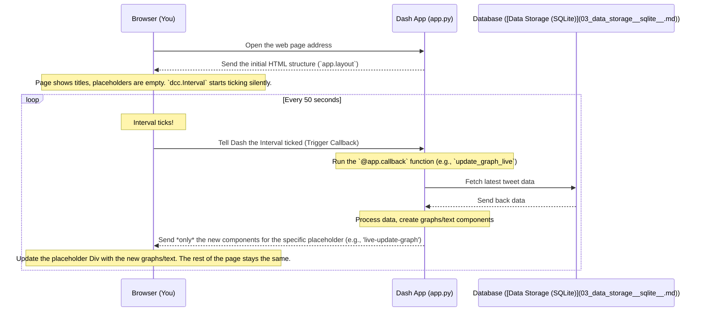

# Chapter 1: Dash Web Application

Welcome to the `test_app_new` project! This is the first chapter of our tutorial, where we'll explore the user interface of our application. Imagine you're building a cool project that analyzes Twitter data in real-time. How would you actually *see* the results? You wouldn't want to just stare at lines of code or raw data tables, right? You'd want a nice, visual dashboard!

That's exactly what this chapter is about. We need a way to present the information clearly and interactively. This is the job of our **Dash Web Application**.

## What is a Dash Web Application?

Think about the dashboard in a car. It doesn't *make* the car go, but it shows you important information like your speed, fuel level, and engine temperature. It also has controls like the steering wheel and pedals.

Our Dash Web Application, defined primarily in the `app.py` file, is like that car dashboard for our Twitter analysis project.

*   **It displays information:** It shows titles, explanatory text, and most importantly, placeholders where our graphs and statistics (like tweet counts, sentiment scores, maps) will appear.
*   **It provides structure:** It organizes how everything is laid out on the web page.
*   **It's built with Dash:** Dash is a fantastic tool (a Python framework) specifically designed for building data visualization dashboards like this one, without needing to be a web development expert.

So, the main problem this component solves is: **How do we create a user-friendly web page to display our real-time Twitter analysis results?** The answer is: by using Dash to build a web application.

## Key Ideas in Dash

Dash uses a few core concepts that work together:

1.  **Layout (`app.layout`):** This defines *what* appears on the page and *where*. It's like the blueprint of our dashboard, specifying the arrangement of titles, text paragraphs, and spots for graphs. We use components (like Lego bricks) to build this structure.
2.  **Components:** These are the individual building blocks of the layout. Dash provides two main types:
    *   **HTML Components (`dash_html_components` or `html`):** These represent standard HTML tags like headings (`html.H2`), paragraphs (`html.P`), and containers (`html.Div`). They are used for the basic structure and text content.
    *   **Core Components (`dash_core_components` or `dcc`):** These are interactive elements provided by Dash, such as graphs (`dcc.Graph`), dropdowns, sliders, and timers (`dcc.Interval`). They make the dashboard dynamic.
3.  **Callbacks (`@app.callback`):** This is the magic that makes the dashboard *interactive* and *live*. Callbacks are Python functions that automatically run when something changes (e.g., a timer ticks, a user clicks a button). They take inputs, process data, and update outputs (like graphs or text). Think of it like the wiring connecting a light switch (Input) to a light bulb (Output).

## How `app.py` Uses Dash

Let's look at how our `app.py` file sets up this dashboard. Don't worry about understanding every single line yet; focus on the main parts.

**1. Setting up the App:**
First, we import Dash and create an instance of a Dash application.

```python
# --- File: app.py ---
import dash
import dash_html_components as html # For HTML tags
import dash_core_components as dcc  # For interactive components

# Create the Dash web application
app = dash.Dash(__name__)
app.title = 'Real-Time Twitter Analysis' # Browser tab title

# The 'server' variable is needed for deployment later
server = app.server
```
This code simply creates our Dash app object, which we'll configure next.

**2. Defining the Layout:**
The `app.layout` variable defines the entire structure of the web page. It's typically an `html.Div` component acting as the main container, holding all other components.

```python
# --- File: app.py ---
# (Imports and app creation shown above)

# Define the structure (layout) of the web page
app.layout = html.Div(children=[
    # Main Title on the page
    html.H2('Real-time Twitter Analysis', style={'textAlign': 'center'}),

    # Placeholder 1: Top graphs will go here
    html.Div(id='live-update-graph'),

    # Placeholder 2: Bottom graphs/maps will go here
    html.Div(id='live-update-graph-bottom'),

    # A timer component to trigger updates automatically
    dcc.Interval(
        id='interval-component-slow',
        interval=50000, # Update every 50,000 ms (50 seconds)
        n_intervals=0   # Counter starts at 0
    )
    # ... other components like text and links ...
], style={'padding': '20px'}) # Add some spacing around the content
```
*   We create a main container (`html.Div`).
*   Inside it, we add a title (`html.H2`).
*   Crucially, we add two empty `html.Div` components with specific `id`s: `'live-update-graph'` and `'live-update-graph-bottom'`. These act as placeholders where our dynamic content (graphs, stats) will be loaded later. Think of them as empty picture frames waiting for pictures.
*   We also add a `dcc.Interval`. This component is invisible on the page, but it acts like a clock, triggering an update every 50 seconds. This is key for our *real-time* dashboard!

**3. Making it Live with Callbacks:**
How do the placeholders get filled? And how do they update? Through Callbacks! A callback links an `Input` (what triggers the update) to an `Output` (what gets updated).

Here's the basic structure of one of the callbacks in `app.py`. We'll simplify the inside of the function for now.

```python
# --- File: app.py ---
from dash.dependencies import Input, Output
# ... other imports and app layout ...

# This decorator links the Input and Output
@app.callback(
    Output('live-update-graph', 'children'), # OUTPUT: Update the 'children' of the Div with id 'live-update-graph'
    [Input('interval-component-slow', 'n_intervals')] # INPUT: Triggered by the 'n_intervals' property of the Interval
)
def update_graph_live(n): # This function runs every time the Interval ticks
    # --- What happens inside this function (Simplified): ---
    # 1. Fetch fresh data from our database
    #    (We'll learn about this in [Data Storage (SQLite)](03_data_storage__sqlite__.md))
    print("Fetching new data...")

    # 2. Process the data and create visualizations (graphs, stats)
    #    (More in [Sentiment & Time-Series Analysis](04_sentiment___time_series_analysis_.md)
    #     and [Visualization Components](06_visualization_components_.md))
    print("Creating graphs...")
    new_content = html.Div([
        html.P(f"Dashboard updated {n} times!"),
        # In the real app, dcc.Graph components are created here
    ])

    # 3. Return the new components to Dash
    #    Dash will automatically put this content inside the 'live-update-graph' Div
    return new_content

# --- Another callback exists to update 'live-update-graph-bottom' ---
# @app.callback(...)
# def update_graph_bottom_live(n):
#     ... similar process ...
```

*   The `@app.callback(...)` part is called a "decorator". It tells Dash: "When the `n_intervals` property of the component with `id='interval-component-slow'` changes, run the function `update_graph_live` and use its return value to update the `children` property of the component with `id='live-update-graph'`."
*   So, every 50 seconds, the `dcc.Interval` updates its `n_intervals` count.
*   This triggers the `update_graph_live` function.
*   Inside the function (in the real code), we fetch the latest Twitter data from our [Data Storage (SQLite)](03_data_storage__sqlite__.md), perform analysis like [Sentiment & Time-Series Analysis](04_sentiment___time_series_analysis_.md), create graphs using [Visualization Components](06_visualization_components_.md), and bundle them into new Dash components (like `html.Div` containing `dcc.Graph`s).
*   The function returns these new components.
*   Dash cleverly updates *only* the necessary part of the web page (the `live-update-graph` Div) with this new content, without needing to reload the entire page.

A similar callback (`update_graph_bottom_live`) exists to update the other placeholder (`live-update-graph-bottom`) with different content like maps and word clouds.

## What Happens When You View the Page?

Let's trace the flow from opening the page to seeing updated data:



This cycle repeats, ensuring the dashboard stays up-to-date with the latest Twitter analysis without needing manual refreshes.

## Conclusion

In this chapter, we learned about the foundation of our project's user interface: the **Dash Web Application**. We saw that `app.py` uses the Dash framework to:

1.  Define the **Layout**: The structure of the web page using HTML and Core Components.
2.  Create **Placeholders**: Specific `Div` elements (`live-update-graph`, `live-update-graph-bottom`) identified by IDs, ready to receive content.
3.  Use an **Interval**: A timer (`dcc.Interval`) to trigger updates periodically.
4.  Implement **Callbacks**: Python functions (`@app.callback`) that connect the timer's ticks (Input) to the placeholders (Output), filling them with updated content generated from data.

This Dash application acts as the visual front-end, the dashboard where we can see everything happening. But where does the initial data come from? How do we get tweets from Twitter in the first place?

That's what we'll explore in the next chapter!

**Next:** [Chapter 2: Twitter Data Streamer](02_twitter_data_streamer_.md)

---

Generated by [AI Codebase Knowledge Builder](https://github.com/The-Pocket/Tutorial-Codebase-Knowledge)