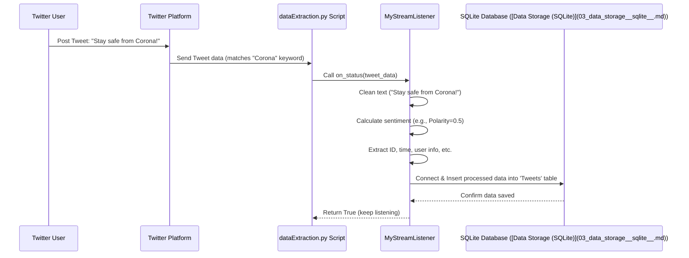

# Chapter 2: Twitter Data Streamer

Welcome to Chapter 2! In the [previous chapter](01_dash_web_application_.md), we saw how our project uses a [Dash Web Application](01_dash_web_application_.md) to display information like graphs and statistics. But where does all that information come from? Our dashboard needs fresh data about tweets to show anything interesting!

Imagine you want to build a system that tracks mentions of "COVID19" or "Corona" on Twitter *as they happen*. You need a way to constantly listen to the global conversation on Twitter and grab the relevant tweets immediately. Staring at the Twitter website and manually copying tweets won't work – there are too many!

This is the exact problem our **Twitter Data Streamer** solves. It's the part of our project responsible for getting live tweet data.

## What is a Twitter Data Streamer?

Think of the Twitter Data Streamer (`dataExtraction.py`) as a specialized radio antenna constantly tuned to Twitter. Instead of radio waves, it listens for tweets. You tell it specific keywords you're interested in (like "COVID19", "Corona"), and whenever someone posts a tweet containing those words, the antenna picks it up instantly.

But it doesn't just grab the raw tweet. It also does a bit of quick processing:

1.  **Listens:** Connects to Twitter's live feed (the "Streaming API").
2.  **Filters:** Only catches tweets containing our keywords (`"COVID19"`, `"Corona"`, etc.).
3.  **Cleans:** Tidies up the tweet text (e.g., removes weird characters or links).
4.  **Analyzes:** Briefly checks the tweet's sentiment (is it positive, negative, or neutral?).
5.  **Prepares:** Organizes the important information (tweet text, time, user details, sentiment score, location if available) so it's ready to be saved.

Essentially, it ensures we have a continuous flow of relevant, slightly processed tweets ready for storage and deeper analysis later.

## Key Concepts

*   **Twitter Streaming API:** This is a service provided by Twitter that lets developers connect and receive tweets in real-time, rather than having to constantly ask "Are there any new tweets yet?".
*   **Keywords (`TRACK_WORDS`):** These are the specific terms we tell the Streaming API to look for. Our streamer will only receive tweets that match at least one of these words.
*   **Listener (`MyStreamListener`):** In our code, this is an object specifically designed to handle incoming tweets from the stream. When a new tweet arrives, the listener wakes up, processes it, and saves it.
*   **Tweepy:** A helpful Python library that makes it much easier to interact with the Twitter API, including the Streaming API. We don't have to handle the complex network connection details ourselves.
*   **TextBlob:** Another Python library used here for a quick sentiment analysis check on the tweet text.

## How it Works: Getting Live Tweets

The core of this component is the `dataExtraction.py` script. Let's walk through how it uses these concepts.

**1. Setup and Keywords:**
First, the script defines the keywords we care about and prepares to connect to our data storage.

```python
# --- File: dataExtraction.py ---
import tweepy # Library to talk to Twitter
import sqlite3 # To interact with the database later
from textblob import TextBlob # For sentiment analysis
import re # For cleaning text

# Define the keywords we want to track on Twitter
TRACK_WORDS = ["Corona Virus", "Corona", "COVID19", "Covid-19"]
DATABASE_NAME = 'Twitterdata.db' # Where we'll eventually store the data
TABLE_NAME = "Tweets" # The table name in the database

# Connect to the SQLite database (explained more in Chapter 3)
conn = sqlite3.connect(DATABASE_NAME)
# ... (Code to ensure the 'Tweets' table exists) ...
conn.close() # Close connection for now, listener will reconnect
```
This sets up our target keywords and makes sure the database file exists. The actual saving happens inside the listener.

**2. Cleaning Helpers:**
We have small helper functions to clean up the tweet text.

```python
# --- File: dataExtraction.py ---
def clean_tweet(tweet_text):
    '''Remove mentions, hashtags, links, etc.'''
    # Uses regular expressions (re) for pattern matching
    return ' '.join(re.sub("(@[A-Za-z0-9]+)|([^0-9A-Za-z \t])|(\w+:\/\/\S+)", " ", tweet_text).split())

def deEmojify(text):
    '''Remove emoji characters.'''
    if text:
        # Keep only standard ASCII characters
        return text.encode('ascii', 'ignore').decode('ascii')
    else:
        return None
```
These functions make the tweet text simpler and easier to analyze later. `clean_tweet` removes things like `@username` and `http://...` links. `deEmojify` removes emojis which can sometimes cause issues.

**3. The Listener (`MyStreamListener`):**
This is the heart of the streamer. It inherits from `tweepy.StreamListener` and defines what to do when specific events happen. The most important event is receiving a tweet (`on_status`).

```python
# --- File: dataExtraction.py ---
class MyStreamListener(tweepy.StreamListener):
    '''This class defines how we react to incoming tweets.'''

    def on_status(self, status):
        '''Called whenever a new tweet arrives that matches our keywords.'''
        print("Received a tweet!")

        # 1. Ignore retweets to avoid duplicates
        if hasattr(status, "retweeted_status"):
            return True # Skip this tweet

        # 2. Get the full text (handles longer tweets)
        tweet_text = status.text
        if hasattr(status, 'extended_tweet'):
            tweet_text = status.extended_tweet['full_text']

        # 3. Clean the text
        cleaned_text = clean_tweet(tweet_text)
        cleaned_text = deEmojify(cleaned_text)
        if not cleaned_text: # Skip if text is empty after cleaning
            return True

        # 4. Analyze Sentiment
        sentiment = TextBlob(cleaned_text).sentiment
        polarity = sentiment.polarity # How positive/negative (-1 to +1)
        subjectivity = sentiment.subjectivity # How objective/subjective (0 to 1)

        # 5. Extract other useful info
        id_str = status.id_str
        created_at = status.created_at
        user_location = deEmojify(status.user.location)
        longitude, latitude = None, None
        if status.coordinates: # Check if precise location exists
            longitude = status.coordinates['coordinates'][0]
            latitude = status.coordinates['coordinates'][1]

        print(f"  Text: {cleaned_text[:50]}...") # Print first 50 chars
        print(f"  Sentiment Polarity: {polarity:.2f}")

        # 6. Prepare data for storage (Connect to DB within the function)
        db_conn = sqlite3.connect(DATABASE_NAME)
        cursor = db_conn.cursor()
        sql = f"INSERT INTO {TABLE_NAME} (id_str, created_at, text, polarity, ...) VALUES (?, ?, ?, ?, ...)"
        # We collect all the extracted data (id_str, created_at, cleaned_text, polarity, ...)
        values = (id_str, created_at, cleaned_text, polarity, ...) # Truncated for brevity
        cursor.execute(sql, values)
        db_conn.commit()
        cursor.close()
        db_conn.close()
        print("  Tweet saved to database!")

        return True # Keep the stream running

    def on_error(self, status_code):
        '''Called if an error occurs (e.g., hitting rate limits).'''
        if status_code == 420:
            print("Error 420: Rate limit reached. Stopping stream.")
            # Returning False disconnects the stream
            return False
```
*   The `on_status` method receives a `status` object (which represents a tweet) from Tweepy.
*   It checks if it's a retweet and ignores it if so.
*   It grabs the full text, cleans it using our helper functions.
*   It uses `TextBlob` to calculate `polarity` and `subjectivity`.
*   It extracts other details like the tweet's ID, creation time, user location (if available), and geographic coordinates (if the user shared them).
*   Finally, it connects to our [Data Storage (SQLite)](03_data_storage__sqlite__.md) database and inserts this organized information into the `Tweets` table.
*   The `on_error` method handles specific errors, like the `420` error which means we're making requests too quickly and need to back off.

**4. Starting the Stream:**
Finally, the script needs to authenticate with Twitter and start the listening process.

```python
# --- File: dataExtraction.py ---

# IMPORTANT: Replace with your actual Twitter API keys!
# Keep these secret. Never share them publicly.
consumer_key = "YOUR_CONSUMER_KEY"
consumer_secret = "YOUR_CONSUMER_SECRET"
access_key = "YOUR_ACCESS_KEY"
access_secret = "YOUR_ACCESS_SECRET"

# --- Authentication ---
auth = tweepy.OAuthHandler(consumer_key, consumer_secret)
auth.set_access_token(access_key, access_secret)
api = tweepy.API(auth, wait_on_rate_limit=True, wait_on_rate_limit_notify=True)

# --- Create Listener and Stream ---
myStreamListener = MyStreamListener()
myStream = tweepy.Stream(auth=api.auth, listener=myStreamListener, tweet_mode='extended')

# --- Start Listening! ---
print(f"Starting stream, tracking: {TRACK_WORDS}")
# This line connects to Twitter and starts receiving tweets
# It will run forever until stopped or an error occurs (like 420)
myStream.filter(languages=["en"], track=TRACK_WORDS)

# Note: The original code has a while True loop for resilience,
#       restarting the stream if it disconnects unexpectedly.
# while True:
#     try:
#         myStream.filter(...)
#     except Exception as e:
#         print(f"Stream error: {e}. Restarting...")
#         time.sleep(15) # Wait before restarting
#         continue
```
*   It sets up authentication credentials (you need to get these from Twitter Developer Portal). **Never put real credentials directly in code you share!** Use environment variables or configuration files (like discussed in [Configuration & Utilities](09_configuration___utilities_.md)).
*   It creates an `OAuthHandler` and an `API` object using `tweepy`.
*   It creates an instance of our custom `MyStreamListener`.
*   It creates a `tweepy.Stream` object, passing our authentication details and listener instance. We use `tweet_mode='extended'` to make sure we get the full text of tweets.
*   The crucial line is `myStream.filter(languages=["en"], track=TRACK_WORDS)`. This tells Tweepy to:
    *   Connect to the Twitter Streaming API.
    *   Only send us tweets written in English (`languages=["en"]`).
    *   Only send us tweets containing any of the words in our `TRACK_WORDS` list.
*   This function will then block and continuously run, calling our `myStreamListener.on_status` method every time a matching tweet is found.

## What Happens When a Tweet is Posted?

Let's visualize the flow when someone tweets "Stay safe from Corona!":



This cycle repeats for every single tweet matching our keywords, continuously adding fresh data to our database.

## Conclusion

The **Twitter Data Streamer** (`dataExtraction.py`) is our project's data collector. It acts like an antenna, constantly listening to Twitter for specific keywords (`TRACK_WORDS`). Using libraries like `tweepy` and `textblob`, it:

1.  Connects to the live Twitter stream.
2.  Filters tweets based on keywords.
3.  Cleans the tweet text.
4.  Performs basic sentiment analysis.
5.  Extracts relevant information.
6.  Prepares this data for storage.

It ensures that the data flowing into our system is fresh, relevant, and pre-processed, ready for the next stage.

But where exactly does this processed data go? How is it stored efficiently so our [Dash Web Application](01_dash_web_application_.md) can access it quickly? That's the topic of our next chapter!

**Next:** [Chapter 3: Data Storage (SQLite)](03_data_storage__sqlite__.md)

---

Generated by [AI Codebase Knowledge Builder](https://github.com/The-Pocket/Tutorial-Codebase-Knowledge)