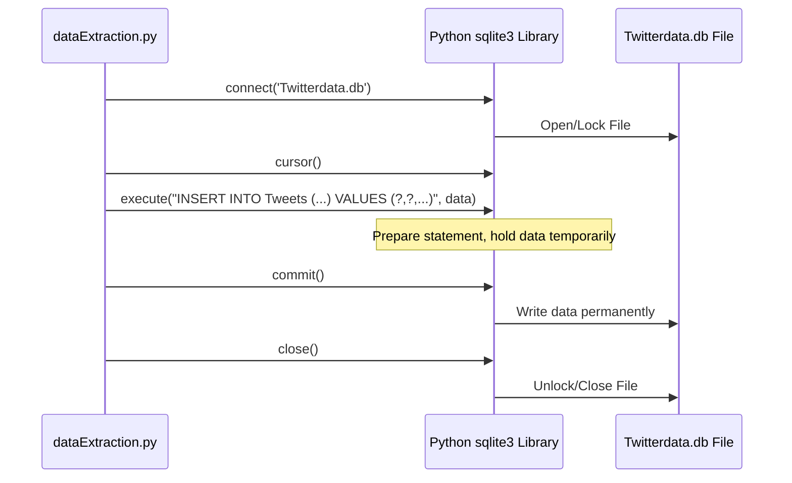
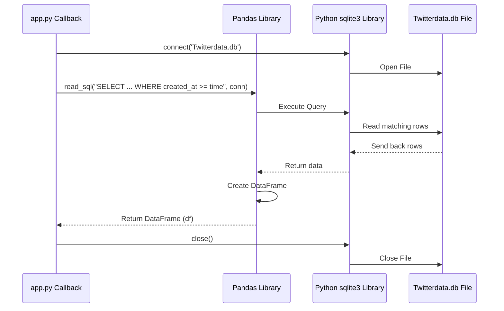

# Chapter 3: Data Storage (SQLite)

Welcome to Chapter 3! In the [previous chapter](02_twitter_data_streamer_.md), we learned how our [Twitter Data Streamer](02_twitter_data_streamer_.md) diligently listens for tweets containing specific keywords, cleans them up, and performs a quick sentiment check. That's great, but once the streamer processes a tweet, where does that information go? If the streamer just printed it to the screen and forgot about it, our [Dash Web Application](01_dash_web_application_.md) would have no data to display!

We need a place to *permanently store* this valuable tweet data so that other parts of our project can access it later. Think of it like taking notes in a meeting – you write them down so you can refer back to them.

This is the job of our **Data Storage** system. For this project, we use a simple and efficient tool called **SQLite**.

## What is SQLite?

Imagine you have a physical filing cabinet where you store important documents. SQLite is like a *digital* filing cabinet, but instead of a big metal cabinet, it's just a single file on your computer! In our project, this file is named `Twitterdata.db`.

Here's why SQLite is great for beginners and this project:

*   **Simple:** It doesn't require a complex server setup like bigger databases (e.g., PostgreSQL, MySQL). It's self-contained in one file.
*   **Lightweight:** It's small and efficient.
*   **Persistent:** Data saved in the SQLite file stays there even if you close the application or restart your computer (just like papers in a real filing cabinet).

The main problem SQLite solves for us is: **How do we save the processed tweet data reliably so it can be read later by the dashboard application?** The answer is: by using SQLite to store the data in the `Twitterdata.db` file.

## Key Concepts of SQLite

Let's understand the basic parts of our digital filing cabinet:

1.  **Database (`Twitterdata.db`):** This is the entire filing cabinet itself, represented by the single file `Twitterdata.db`. It holds all our stored information.
2.  **Table (`Tweets`):** Inside the cabinet, you might have different drawers or folders for different types of documents. In SQLite, these are called "Tables". We have one main table called `Tweets` where we store all the information about the tweets collected by our streamer.
3.  **Columns:** Each piece of paper (or record) in our `Tweets` folder needs specific fields. These are the "Columns" of our table. They define *what kind* of information we store for each tweet. Examples include:
    *   `id_str`: The unique ID of the tweet.
    *   `created_at`: When the tweet was posted.
    *   `text`: The cleaned text content of the tweet.
    *   `polarity`: The sentiment score (-1, 0, or 1).
    *   `user_location`: Where the user says they are (if provided).
    *   ... and a few others.
4.  **Rows:** Each individual tweet we save becomes a "Row" in the `Tweets` table. A row contains the specific values for each column for that one tweet (e.g., one row might have ID '123', time '2023-10-27 10:00:00', text 'Corona is fading', polarity '1', etc.).
5.  **SQL (Structured Query Language):** How do we tell the filing cabinet (database) what to do? We use a special language called SQL. It has commands like:
    *   `INSERT INTO`: To add a new row (a new tweet) into a table.
    *   `SELECT`: To retrieve (read) data from a table.
    *   `CREATE TABLE`: To define the structure (columns) of a new table (used once at the beginning).

## How We Use SQLite

Our project interacts with the `Twitterdata.db` file in two main ways:

**1. Saving Data (The Streamer Writes)**

The [Twitter Data Streamer](02_twitter_data_streamer_.md) (`dataExtraction.py`), after processing a tweet in its `on_status` method, needs to save the results. It uses SQL's `INSERT` command.

```python
# --- Simplified snippet from dataExtraction.py (inside on_status) ---
import sqlite3 # Python's built-in library to talk to SQLite

# ... (Extract tweet info: id_str, created_at, text, polarity, ...) ...
DATABASE_NAME = 'Twitterdata.db'
TABLE_NAME = "Tweets"

# Connect to the SQLite database file
db_conn = sqlite3.connect(DATABASE_NAME)
cursor = db_conn.cursor() # Create a 'cursor' to execute commands

# Prepare the SQL command to insert a new row
# The '?' are placeholders for the actual values
sql = f"INSERT INTO {TABLE_NAME} (id_str, created_at, text, polarity, ...) VALUES (?, ?, ?, ?, ...)"

# Package the extracted data into a tuple (order matters!)
values = (id_str, created_at, text, polarity, ...) # Add all values here

# Execute the command with the values
cursor.execute(sql, values)

# IMPORTANT: Commit (save) the changes to the database file
db_conn.commit()

# Close the connection
cursor.close()
db_conn.close()
print("  Tweet saved to database!")
```

*   **`import sqlite3`**: We bring in the necessary Python tool.
*   **`sqlite3.connect(...)`**: Opens the connection to our `Twitterdata.db` file (like opening the filing cabinet). If the file doesn't exist, SQLite creates it.
*   **`db_conn.cursor()`**: Gets a "cursor" object, which is like a pen we use to write or read commands.
*   **`sql = "INSERT INTO ..."`**: Defines the command to add data. `VALUES (?, ?, ...)` uses placeholders for safety and efficiency.
*   **`values = (...)`**: Creates a collection of the actual data points for the tweet, matching the order of columns in the `INSERT` statement.
*   **`cursor.execute(sql, values)`**: Sends the command and the data to SQLite.
*   **`db_conn.commit()`**: This is crucial! It tells SQLite to permanently save the changes to the `Twitterdata.db` file. Without this, the changes might be lost.
*   **`db_conn.close()`**: Closes the connection (like closing the cabinet drawer).

**2. Reading Data (The Dashboard Reads)**

The [Dash Web Application](01_dash_web_application_.md) (`app.py`), specifically within its callback functions (`update_graph_live`, `update_graph_bottom_live`), needs to fetch the latest data to create visualizations. It uses SQL's `SELECT` command, often using the `pandas` library for convenience.

```python
# --- Simplified snippet from app.py (inside a @app.callback function) ---
import sqlite3
import pandas as pd # Data analysis library
import datetime

DATABASE_NAME = 'Twitterdata.db'
TABLE_NAME = "Tweets"

# Calculate a time threshold (e.g., get data from the last 30 minutes)
timenow = (datetime.datetime.utcnow() - datetime.timedelta(minutes=30)).strftime('%Y-%m-%d %H:%M:%S')

# Connect to the database
conn = sqlite3.connect(DATABASE_NAME)

# Prepare the SQL command to select specific columns from recent tweets
query = f"SELECT id_str, text, created_at, polarity, user_location FROM {TABLE_NAME} WHERE created_at >= '{timenow}'"

# Use pandas to execute the query and load results directly into a DataFrame
df = pd.read_sql(query, con=conn)

# Close the connection
conn.close()

# Now 'df' is a pandas DataFrame containing the requested tweet data
# We can process 'df' to create graphs (more in Chapter 4 & 6)
print(f"Fetched {len(df)} recent tweets from the database.")
# --- Output (Example): ---
# Fetched 150 recent tweets from the database.
```

*   **`timenow = ...`**: We often only want recent data for a real-time dashboard, so we calculate a past timestamp.
*   **`conn = sqlite3.connect(...)`**: Again, we open the connection.
*   **`query = "SELECT ..."`**: Defines the command to retrieve data.
    *   `SELECT id_str, ...`: Specifies which columns we want.
    *   `FROM {TABLE_NAME}`: Tells SQLite which table to look in.
    *   `WHERE created_at >= '{timenow}'`: This is a filter! It only gets rows where the `created_at` value is later than or equal to our threshold time.
*   **`df = pd.read_sql(query, con=conn)`**: This is a handy function from the `pandas` library. It executes the SQL query using the provided connection (`conn`) and automatically loads the results into a structured format called a DataFrame (`df`), which is great for analysis.
*   **`conn.close()`**: We close the connection once we have the data.
*   The `df` DataFrame now holds the recent tweet data, ready for [Sentiment & Time-Series Analysis](04_sentiment___time_series_analysis_.md) and creating [Visualization Components](06_visualization_components_.md).

## What Happens Under the Hood?

Let's trace the process for saving and reading:

**Saving a Tweet:**



**Reading Recent Tweets:**



## The `Twitterdata.db` File

This single file *is* your database. As the streamer runs, it will add more and more rows to the `Tweets` table inside this file, causing the file size to grow.

You can actually look inside this file using free tools like [DB Browser for SQLite](https://sqlitebrowser.org/). This lets you see the tables, columns, and browse the actual tweet data that has been saved – it's a great way to verify that your streamer is working correctly!

## Conclusion

In this chapter, we learned about the project's memory: the **SQLite Data Storage**.

*   It uses a simple, file-based database (`Twitterdata.db`).
*   It acts like a digital filing cabinet to store processed tweet data persistently.
*   Key concepts include the database file, tables (`Tweets`), columns (tweet attributes), and rows (individual tweets).
*   We use the `sqlite3` Python library and SQL commands (`INSERT`, `SELECT`) to interact with it.
*   The [Twitter Data Streamer](02_twitter_data_streamer_.md) *writes* data into the database using `INSERT`.
*   The [Dash Web Application](01_dash_web_application_.md) *reads* data from the database using `SELECT` (often via `pandas.read_sql`) to get information for display.

Now that we have a way to collect tweets and store them reliably, how do we turn that raw stored data into the interesting graphs and statistics we see on the dashboard? How do we analyze sentiment trends over time or figure out the most common words?

That's what we'll dive into next!

**Next:** [Chapter 4: Sentiment & Time-Series Analysis](04_sentiment___time_series_analysis_.md)

---

Generated by [AI Codebase Knowledge Builder](https://github.com/The-Pocket/Tutorial-Codebase-Knowledge)