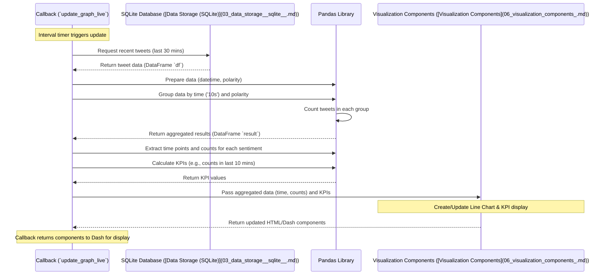

# Chapter 4: Sentiment & Time-Series Analysis

Hi there! Welcome to Chapter 4. In the [previous chapter](03_data_storage__sqlite__.md), we learned how our project stores tweet data neatly in a [Data Storage (SQLite)](03_data_storage__sqlite__.md) database file, like a digital filing cabinet. Now we have all this collected data – tweet text, timestamps, user locations, and even a basic sentiment score calculated by the [Twitter Data Streamer](02_twitter_data_streamer_.md).

But just having data stored isn't enough. How do we make sense of it? Imagine you're tracking reactions to a big event using Twitter. You don't just want a list of tweets; you want to know: **Is the overall mood getting more positive or negative over time? Are people tweeting more or less about it now compared to an hour ago?**

This is exactly what the **Sentiment & Time-Series Analysis** part of our application does. It takes the raw tweet data from the database and transforms it into meaningful trends about public sentiment over time.

## What Problem Does This Solve?

Think of yourself as an analyst watching the stock market. You don't just look at the current price; you look at charts showing how the price has changed over the day, week, or month. This helps you spot trends.

Similarly, our application needs to:

1.  **Analyze Sentiment Trends:** Look at the sentiment scores (positive, negative, neutral) of tweets collected over a recent period.
2.  **Track Volume Over Time:** See how the *number* of tweets (overall, or per sentiment) changes moment by moment.

This analysis turns a stream of individual tweets into a bigger picture – like tracking the "mood swings" of the public conversation related to our tracked keywords (e.g., "COVID"). The results of this analysis are what power the main line chart and the key statistics (like "Total Tweets Today") you see at the top of our [Dash Web Application](01_dash_web_application_.md).

## Key Concepts

Let's break down the main ideas:

1.  **Sentiment Revisited:** As we saw in [Chapter 2](02_twitter_data_streamer_.md), each tweet gets a quick sentiment check (using TextBlob) when it's collected, resulting in a `polarity` score. Our `app.py` code simplifies this score further into three categories: Positive (1), Negative (-1), or Neutral (0). This makes it easier to count tweets in each category.

2.  **Time-Series:** This just means organizing data based on *when* it happened. Since we have timestamps for every tweet (`created_at`), we can group tweets into small time intervals (like "every 10 seconds" or "every minute").

3.  **Aggregation (Grouping and Counting):** Once we group tweets by time intervals, we can *aggregate* them. This means performing calculations on each group. The most common aggregation here is simply *counting*:
    *   How many positive tweets arrived between 10:00:00 and 10:00:10?
    *   How many negative tweets arrived in that same interval?
    *   How many neutral?

By doing this for many consecutive time intervals, we build a time-series dataset showing how sentiment counts change over time.

## How We Analyze Sentiment Over Time

The analysis happens inside the `update_graph_live` function within our `app.py` file, which is triggered periodically by the `dcc.Interval` component (as we saw in [Chapter 1](01_dash_web_application_.md)).

Here's a simplified view of the steps:

1.  **Fetch Recent Data:** Get the tweets stored in the [Data Storage (SQLite)](03_data_storage__sqlite__.md) database from the last 30 minutes.
2.  **Prepare Data:**
    *   Convert the stored timestamps into a format that's easy to work with (like Python's `datetime` objects).
    *   Ensure the `polarity` score is neatly categorized as -1 (Negative), 0 (Neutral), or 1 (Positive).
3.  **Group and Aggregate:** Use the powerful `pandas` library to:
    *   Group the tweets into 10-second intervals based on their `created_at` time.
    *   Within each interval, further group the tweets by their `polarity` (Positive, Negative, Neutral).
    *   Count how many tweets fall into each sentiment category within each 10-second interval.
4.  **Prepare for Visualization:** Organize the results (time intervals and corresponding sentiment counts) so they can be easily plotted on a graph.
5.  **Calculate KPIs:** Calculate summary statistics like the total number of tweets collected today, or the percentage change in tweet volume over the last 10 minutes.

Let's look at some simplified code snippets from `app.py` to see this in action.

**Step 1 & 2: Fetch and Prepare Data**

```python
# --- File: app.py (inside update_graph_live function) ---
import pandas as pd
import sqlite3
import datetime
import config as c # Our config file

# Connect to the database
conn = sqlite3.connect(c.DATABASE_NAME)
# Fetch tweets from the last 30 minutes
timenow = (datetime.datetime.utcnow() - datetime.timedelta(minutes=30)).strftime('%Y-%m-%d %H:%M:%S')
query = f"SELECT id_str, created_at, polarity FROM {c.TABLE_NAME} WHERE created_at >= '{timenow}'"
df = pd.read_sql(query, con=conn)
conn.close()

# Convert 'created_at' string to datetime objects
# (Simplified - original code also handles timezones)
df['created_at'] = pd.to_datetime(df['created_at'])

# Ensure polarity is -1, 0, or 1 using a helper function from config.py
df['polarity'] = df['polarity'].apply(c.polarity_change)
```

*   We connect to the database and use `pd.read_sql` to grab recent tweets into a pandas DataFrame `df`.
*   We convert the `created_at` column so pandas understands it as time data.
*   We use `c.polarity_change` (a simple function defined in `config.py`) to make sure the sentiment score is exactly -1, 0, or 1.

**Step 3: Group and Aggregate**

This is where the magic of `pandas` comes in!

```python
# --- File: app.py (inside update_graph_live function) ---

# Group by 10-second intervals ('10s') and by 'polarity'
# Then count the number of tweets (using 'id_str') in each group
# .unstack().stack() is a pandas trick to handle missing groups (e.g., no negative tweets in an interval)
result = df.groupby([pd.Grouper(key='created_at', freq='10s'), 'polarity'])\
           .count()['id_str']\
           .unstack(fill_value=0).stack()\
           .reset_index()

# Rename columns for clarity
result = result.rename(columns={"id_str": "Num of Mentions", "created_at":"Time"})

# Example 'result' DataFrame might look like:
#                  Time  polarity  Num of Mentions
# 0 2023-10-27 10:00:00        -1                2
# 1 2023-10-27 10:00:00         0                5
# 2 2023-10-27 10:00:00         1                3
# 3 2023-10-27 10:00:10        -1                1
# 4 2023-10-27 10:00:10         0                7
# 5 2023-10-27 10:00:10         1                4
# ... and so on for every 10 seconds ...
```

*   `pd.Grouper(key='created_at', freq='10s')`: This tells pandas to group the rows based on the `created_at` column, creating bins of 10 seconds each.
*   `groupby([... , 'polarity'])`: We group by *both* the time interval and the sentiment category.
*   `.count()['id_str']`: For each group, we count how many tweet IDs (`id_str`) there are.
*   `.unstack(fill_value=0).stack()`: This clever bit makes sure that if, for example, there were *no* negative tweets in a particular 10-second interval, we still get a row for negatives with a count of 0, which is important for plotting.
*   `.reset_index()`: Cleans up the structure into a nice table.
*   The final `result` DataFrame contains the time-series data: for each 10-second slot, it tells us the count of positive, negative, and neutral tweets.

**Step 4 & 5: Prepare for Visualization & Calculate KPIs**

The `result` DataFrame is now ready to be used by Plotly (our graphing library) to create the line chart. The code then extracts specific data from `result` to plot.

```python
# --- File: app.py (inside update_graph_live function) ---

# Extract the time points for the x-axis of the chart
time_series = result["Time"][result['polarity']==0].reset_index(drop=True)

# Extract counts for neutral, negative, positive tweets for the y-axis
neutral_counts = result["Num of Mentions"][result['polarity']==0].reset_index(drop=True)
negative_counts = result["Num of Mentions"][result['polarity']==-1].reset_index(drop=True)
positive_counts = result["Num of Mentions"][result['polarity']==1].reset_index(drop=True)

# --- Calculate KPIs (Key Performance Indicators) ---
# Example: Count sentiments in the last 10 minutes
min10 = datetime.datetime.now() - datetime.timedelta(minutes=10)
neu_num = result[result['Time'] > min10]["Num of Mentions"][result['polarity']==0].sum()
neg_num = result[result['Time'] > min10]["Num of Mentions"][result['polarity']==-1].sum()
pos_num = result[result['Time'] > min10]["Num of Mentions"][result['polarity']==1].sum()

# (Other KPIs like total tweets, daily tweets are also calculated using separate DB queries)
# ... code to create Plotly graphs using time_series, neutral_counts, etc. ...
# ... code to create HTML components displaying KPIs like neu_num, neg_num, pos_num ...
```

*   We pull out the lists of time points and the corresponding counts for each sentiment type. These lists are directly fed into the `go.Scatter` objects used to create the line chart (more on this in [Chapter 6: Visualization Components](06_visualization_components_.md)).
*   We also calculate summary numbers, like the total positive, negative, and neutral tweets received in the *last 10 minutes*, which are displayed in the pie chart and potentially the top KPI section.

## What Happens Under the Hood?

Let's trace the flow when the dashboard needs to update the sentiment trend chart:



This process efficiently transforms the raw stored data into the time-based sentiment insights displayed on the dashboard.

## Conclusion

In this chapter, we explored **Sentiment & Time-Series Analysis**. We saw how the application takes the tweet data collected by the [Twitter Data Streamer](02_twitter_data_streamer_.md) and stored in the [Data Storage (SQLite)](03_data_storage__sqlite__.md) and processes it further.

Specifically, we learned how `app.py`, using the `pandas` library:

1.  Fetches recent tweets from the database.
2.  Groups these tweets into small time intervals (10 seconds).
3.  Counts the number of positive, negative, and neutral tweets within each interval.
4.  Calculates key summary statistics (KPIs).

This analysis provides the crucial data needed to visualize how public sentiment and tweet volume are trending over time, powering key elements of our [Dash Web Application](01_dash_web_application_.md).

But sentiment and time trends aren't the only interesting things we can analyze. What about the actual *words* people are using? Or *where* in the world are these tweets coming from? That's what we'll investigate next!

**Next:** [Chapter 5: Text & Geographic Analysis](05_text___geographic_analysis_.md)

---

Generated by [AI Codebase Knowledge Builder](https://github.com/The-Pocket/Tutorial-Codebase-Knowledge)