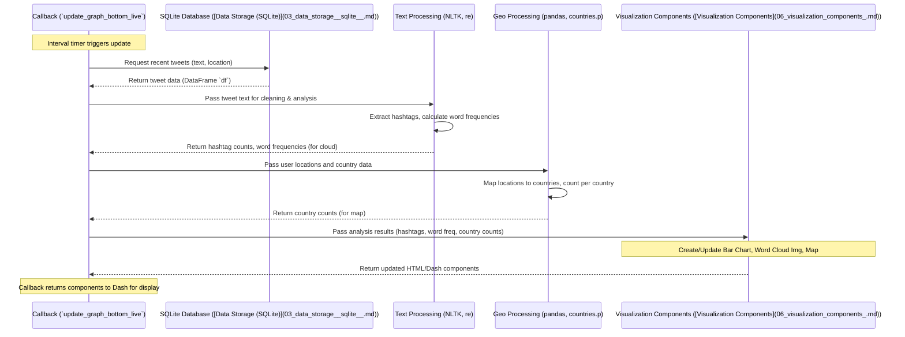

# Chapter 5: Text & Geographic Analysis

Welcome to Chapter 5! In the [previous chapter](04_sentiment___time_series_analysis_.md), we explored how our application analyzes sentiment trends over time, essentially tracking the *mood* of the conversation about our keywords. That gives us a great overview, but what if we want to dig deeper?

Imagine you want to know: **What specific topics or hashtags are people mentioning most frequently within the COVID conversation? And where in the world are these tweets coming from?** Are certain hashtags more popular in specific countries? Just knowing the sentiment isn't enough; we need to understand the *content* and *origin* of the tweets.

This is precisely what the **Text & Geographic Analysis** component does. It takes the raw tweet data and:

1.  Analyzes the **text** to find popular hashtags and common words.
2.  Analyzes the **location** information to see where tweets originate geographically.

The results of this analysis power the bottom row of our [Dash Web Application](01_dash_web_application_.md), showing a bar chart of top hashtags, a map highlighting tweet origins by country, and a "word cloud" visualizing frequent terms.

## Key Concepts

Let's break down the ideas behind this analysis:

1.  **Text Analysis:** Getting insights from the actual words written in the tweets.
    *   **Hashtag Extraction:** Finding words or phrases marked with a `#` symbol (like `#COVID19`, `#StayHome`). These often represent key topics. We use simple pattern matching (regular expressions) to find these.
    *   **Tokenization:** Breaking down the tweet text into individual words or "tokens". For example, "Stay safe everyone!" becomes ["Stay", "safe", "everyone", "!"].
    *   **Stop Word Removal:** Removing common words (like "the", "a", "is", "in", "and") that don't usually carry much specific meaning for analysis. These are called "stop words".
    *   **Word Frequency:** Counting how often each remaining word appears across all the recent tweets. This helps identify the most commonly used terms.
    *   **Word Cloud:** A visual way to show word frequency. More frequent words appear larger in the cloud.

2.  **Geographic Analysis:** Figuring out the origin of tweets.
    *   **User Location Field:** Twitter users can optionally enter a location in their profile (e.g., "London, UK", "California", "Planet Earth"). Our [Twitter Data Streamer](02_twitter_data_streamer_.md) saves this text if available.
    *   **Mapping to Countries:** This is tricky! The location field is free-form text, so it might be messy or vague. Our analysis tries its best to match this text to a known list of countries or regions. We use a pre-prepared list stored in a file (`countries.p`) for this matching.
    *   **Aggregation:** Counting how many tweets we successfully mapped to each country within our recent data.

## How We Analyze Text and Location

This analysis takes place inside the *second* callback function in `app.py`, named `update_graph_bottom_live`. This function, just like the one for sentiment analysis, is triggered periodically by the `dcc.Interval` component.

Here's a step-by-step overview of what happens inside `update_graph_bottom_live`:

1.  **Fetch Recent Data:** Get tweets from the last 30 minutes from our [Data Storage (SQLite)](03_data_storage__sqlite__.md), specifically grabbing the `text` and `user_location` columns.
2.  **Process Text:**
    *   Combine the text from all fetched tweets into one large block of text.
    *   Clean this text (remove URLs, special characters, etc.).
    *   Extract all hashtags (`#topic`).
    *   Tokenize the cleaned text into words.
    *   Remove stop words.
    *   Calculate the frequency of the remaining words.
    *   Calculate the frequency of the extracted hashtags.
    *   Prepare the word frequency data for generating a word cloud image.
    *   Prepare the hashtag frequency data for a bar chart.
3.  **Process Locations:**
    *   Load the predefined list of countries and their codes (from `countries.p`).
    *   Go through the `user_location` field for each tweet.
    *   Try to match the location text to a country in our list.
    *   Count the number of tweets successfully matched to each country.
    *   Prepare this country count data for display on a world map (a "choropleth map").
4.  **Return Visualizations:** Send the prepared data to [Visualization Components](06_visualization_components_.md) to create the hashtag bar chart, the geographic map, and the word cloud image, which are then displayed in the bottom row of the dashboard.

Let's look at simplified code snippets from `app.py` to illustrate these steps.

**Step 1: Fetch Data**

```python
# --- File: app.py (inside update_graph_bottom_live function) ---
import pandas as pd
import sqlite3
import datetime
import config as c # Our config file
import re
import nltk
from nltk.probability import FreqDist
from nltk.tokenize import word_tokenize
from nltk.corpus import stopwords
import pickle # To load country data

# Connect to the database and fetch recent tweets
conn = sqlite3.connect(c.DATABASE_NAME)
timenow = (datetime.datetime.utcnow() - datetime.timedelta(minutes=30)).strftime('%Y-%m-%d %H:%M:%S')
# Select text and location this time
query = f"SELECT text, user_location FROM {c.TABLE_NAME} WHERE created_at >= '{timenow}'"
df = pd.read_sql(query, con=conn)
conn.close()

# Fill missing locations with empty string for easier processing
df = df.fillna(" ")
```
This is similar to the previous chapter, but we fetch `text` and `user_location` instead of `polarity`.

**Step 2: Process Text**

```python
# --- File: app.py (inside update_graph_bottom_live function) ---

# Combine all tweet text into one big string
content = ' '.join(df["text"])
# Basic cleaning: remove URLs, 'RT', '&amp;'
content = re.sub(r"http\S+", "", content)
content = content.replace('RT ', ' ').replace('&amp;', 'and')

# Extract hashtags using a helper function from config.py
hashtags = c.hastag(content) # Finds all '#word' patterns

# More cleaning: remove non-alphanumeric characters, convert to lowercase
content = re.sub('[^A-Za-z0-9]+', ' ', content)
content = content.lower()

# Tokenize: Split the cleaned text into words
tokenized_word = word_tokenize(content)

# Remove stop words (like 'the', 'is', 'in')
stop_words = set(stopwords.words("english"))
filtered_sent = []
for w in tokenized_word:
    if (w not in stop_words) and (len(w) >= 3): # Keep words with >= 3 chars
        filtered_sent.append(w)

# --- Calculate Frequencies ---
# Hashtag frequency
fdist_hashtags = FreqDist(hashtags)
# Get top 10 hashtags (excluding the most frequent, often the search term itself)
fd_hashtags = pd.DataFrame(fdist_hashtags.most_common(10), columns = ["Word","Frequency"]).drop([0]).reindex()

# Word frequency for word cloud (using helper from config.py)
word_cloud_words = c.datakeyValue(filtered_sent) # Gets {word: frequency} dict

# Generate the word cloud image (using another helper)
# plot_wordcloud uses the wordcloud library
img = BytesIO() # Create a temporary place to store the image
plot_wordcloud(data=word_cloud_words).save(img, format='PNG')
# 'img' now contains the generated word cloud image data
```
*   We use `re` (regular expressions) for cleaning text patterns.
*   `c.hastag` is a helper function (likely using `re.findall`) defined in `config.py` to extract hashtags.
*   `nltk` (Natural Language Toolkit) library functions `word_tokenize` and `stopwords` are used for text processing.
*   `FreqDist` (Frequency Distribution) from `nltk` helps count word/hashtag occurrences efficiently.
*   `c.datakeyValue` prepares the word counts for the word cloud generator.
*   `plot_wordcloud` (defined in `app.py` or `config.py`) uses the `wordcloud` library to create the actual image.

**Step 3: Process Locations**

```python
# --- File: app.py (inside update_graph_bottom_live function) ---
import math # For log calculation

# Load pre-processed country data (mapping names/codes)
# This 'countries.p' file was likely created separately (see Chapter 8)
STATES, STATE_DICT, INV_STATE_DICT = pickle.load(open('countries.p','rb'))
# STATES might be a list of country codes like 'USA', 'GBR', 'IND'
# STATE_DICT might map variations ('United States', 'USA') to the code 'USA'
# INV_STATE_DICT might map 'USA' back to 'United States'

# Try to match user locations to countries
mapped_countries = []
for location_text in df['user_location']:
    found_country = None
    for country_code in STATES: # Check against our known country codes/names
        # (Simplified logic: the real code checks variations)
        if country_code in location_text or STATE_DICT.get(country_code) in location_text:
             mapped_countries.append(country_code)
             found_country = True
             break
    if not found_country:
        mapped_countries.append(None) # Couldn't map this location

# Count tweets per country
geo_dist = pd.DataFrame(mapped_countries, columns=['CountryCode']).dropna()
geo_dist = geo_dist.groupby('CountryCode').size().reset_index(name='Number')
geo_dist = geo_dist.sort_values(by=['Number'], ascending=False)

# Apply logarithmic scale for better map visualization (optional)
geo_dist["Log Num"] = geo_dist["Number"].apply(lambda x: math.log(x, 2))

# Add full country names for map hover text
geo_dist['Full Country Name'] = geo_dist['CountryCode'].apply(lambda x: INV_STATE_DICT.get(x, x))
geo_dist['text'] = geo_dist['Full Country Name'] + '<br>' + 'Num: ' + geo_dist['Number'].astype(str)

# 'geo_dist' DataFrame now holds country codes, counts, and text for the map
```
*   `pickle.load` reads the prepared country mapping data from the `countries.p` file (more on this in [Chapter 8: Geographic Data Preparation](08_geographic_data_preparation_.md)).
*   The code iterates through each `user_location` string and tries to find a match within the known country names/codes. This matching can be complex in reality.
*   `pandas` is used again (`groupby`, `size`) to count the occurrences for each successfully mapped country.
*   A logarithmic scale (`math.log`) is often used for maps because tweet counts can vary wildly between countries, and logs help show variations in less active countries more clearly.

**Step 4: Return Visualizations**

The calculated data (`fd_hashtags`, `img`, `geo_dist`) is then passed to `dcc.Graph` components using appropriate Plotly chart types (Bar, Choropleth) and `html.Img` for the word cloud. We'll see exactly how in the next chapter.

## What Happens Under the Hood?

Let's visualize the flow when the dashboard updates the bottom row:


This callback focuses on digging into the *content* and *origin* of the tweets, complementing the *sentiment* and *volume* analysis from the previous chapter.

## Conclusion

In this chapter, we delved into **Text & Geographic Analysis**. We saw how the application moves beyond just sentiment to understand:

1.  **What:** Analyzing tweet text using techniques like hashtag extraction, tokenization, stop word removal, and frequency analysis to find key terms and topics.
2.  **Where:** Analyzing user-provided location information, mapping it to countries, and counting tweets per country to understand the geographic distribution.

This analysis is performed within the `update_graph_bottom_live` callback in `app.py`, utilizing libraries like `nltk`, `pandas`, and custom helper functions. The results (hashtag counts, word frequencies, country counts) provide deeper insights into the ongoing Twitter conversation.

Now that we've seen how the data is collected, stored, and analyzed (for both sentiment/time and text/location), how are these results actually turned into the interactive charts and maps we see on the dashboard?

**Next:** [Chapter 6: Visualization Components](06_visualization_components_.md)

---

Generated by [AI Codebase Knowledge Builder](https://github.com/The-Pocket/Tutorial-Codebase-Knowledge)