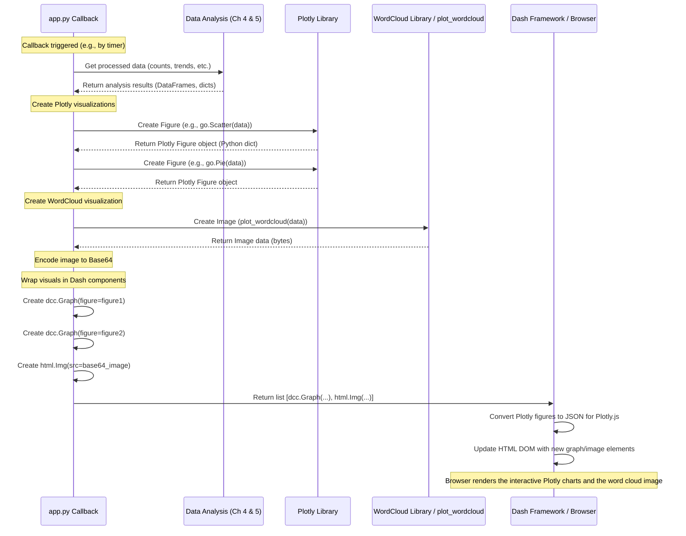

# Chapter 6: Visualization Components

Welcome to Chapter 6! In the [previous chapter](05_text___geographic_analysis_.md), we saw how our application digs into the tweet data to perform [Text & Geographic Analysis](05_text___geographic_analysis_.md), figuring out popular hashtags, common words, and where tweets are coming from. We also saw in [Chapter 4](04_sentiment___time_series_analysis_.md) how we analyze sentiment trends over time.

So now we have all this great processed information:
*   Sentiment counts over time (positive, negative, neutral).
*   Key statistics (total tweets today, recent sentiment breakdown).
*   Top hashtags and their frequencies.
*   Word frequencies for a word cloud.
*   Tweet counts per country.

But how do we actually *see* these results? Just having lists of numbers or words isn't very helpful for quickly understanding the situation. We need to turn this analyzed data into visual charts and images that are easy to grasp at a glance.

This is the job of the **Visualization Components**. They are the individual visual pieces – the charts, the map, the word cloud image – that make up our dashboard display.

## What Problem Do These Components Solve?

Imagine you're looking at the results of our analysis:

*   A list of timestamps with counts: `(10:00:00, pos: 3, neg: 2), (10:00:10, pos: 4, neg: 1), ...`
*   A list of hashtags: `(#covid19: 50 times), (#stayhome: 30 times), ...`
*   A list of countries: `(USA: 100 tweets), (UK: 50 tweets), ...`

It's hard to spot trends or key information from these raw numbers. We need a better way!

The Visualization Components solve this by taking the processed data and transforming it into visual representations like:

*   A **line chart** showing how positive, negative, and neutral tweet counts change over time.
*   A **pie chart** showing the proportion of recent tweets that are positive, negative, or neutral.
*   A **bar chart** showing the most popular hashtags.
*   A **world map** (called a Choropleth map) where countries are colored based on how many tweets came from them.
*   A **word cloud** image where frequently used words appear larger.

These components act like the different dials, gauges, and displays on a car's dashboard, each presenting a specific piece of information visually.

## Key Concepts

Let's look at the tools and ideas we use to create these visuals:

1.  **Plotly:** This is a powerful Python library specifically designed for creating interactive charts and graphs. It provides different "graph objects" for various chart types:
    *   `go.Scatter`: For line charts (like our sentiment trend).
    *   `go.Pie`: For pie charts (like our recent sentiment breakdown).
    *   `go.Bar`: For bar charts (like our top hashtags).
    *   `go.Choropleth`: For creating maps where regions (like countries) are colored based on data values (like tweet counts).
    The basic idea is you give Plotly your data (e.g., x-axis values, y-axis values, labels, numeric values) and tell it which chart type to create.

2.  **WordCloud:** This is another Python library, but it specializes in creating one specific type of visualization: the word cloud image. You give it a dictionary of words and their frequencies, and it generates an image where more frequent words are bigger.

3.  **Dash Core Components (`dcc.Graph`):** Remember from [Chapter 1](01_dash_web_application_.md) that Dash provides components to build the web layout. `dcc.Graph` is a special component that acts as a container to display the interactive charts created by Plotly within our Dash web application.

4.  **Dash HTML Components (`html.Img`):** Since the word cloud is generated as a standard image file (like a PNG), we can't use `dcc.Graph` to display it. Instead, we use a standard HTML image tag, which Dash provides as `html.Img`. We need to give it the image data in a format the browser understands.

## How We Create the Visualizations

The actual creation of these visual components happens inside the callback functions (`update_graph_live` and `update_graph_bottom_live`) in our `app.py` file, right after the data analysis steps we saw in Chapters 4 and 5.

Let's look at simplified examples of how the analyzed data is turned into visuals:

**1. Sentiment Trend Line Chart (in `update_graph_live`)**

After calculating `time_series`, `neutral_counts`, `negative_counts`, and `positive_counts` (as seen in [Chapter 4](04_sentiment___time_series_analysis_.md)), we use Plotly's `go.Scatter`:

```python
# --- File: app.py (inside update_graph_live return value) ---
import plotly.graph_objs as go
import dash_core_components as dcc

# ... analysis code calculates time_series, neutral_counts, etc. ...

sentiment_line_chart = dcc.Graph(
    id='crossfilter-indicator-scatter', # Give the graph an ID
    figure={ # The 'figure' property holds the Plotly chart definition
        'data': [
            # One Scatter trace for neutral tweets
            go.Scatter(
                x=time_series,          # Time points for X-axis
                y=neutral_counts,       # Counts for Y-axis
                name="Neutrals",        # Label for the legend
                mode='lines',           # Draw as lines
                # ... other styling options ...
            ),
            # Another Scatter trace for negative tweets (plotted downwards)
            go.Scatter(
                x=time_series,
                y=negative_counts.apply(lambda x: -x), # Make values negative
                name="Negatives",
                mode='lines',
                # ... other styling options ...
            ),
            # A third Scatter trace for positive tweets
            go.Scatter(
                x=time_series,
                y=positive_counts,
                name="Positives",
                mode='lines',
                # ... other styling options ...
            )
        ],
        'layout': { # Optional layout configuration
            'title': 'Sentiment Trend Over Last 30 Mins'
            # ... other layout options (axes, hover behavior) ...
        }
    }
)
# 'sentiment_line_chart' is now a Dash component ready to be displayed
```
*   We create a `dcc.Graph` component.
*   Inside its `figure` property, we define the `'data'` as a list of `go.Scatter` objects, one for each sentiment category. We provide the `x` (time) and `y` (count) data to each.
*   We also define the `'layout'` to add a title and potentially customize axes.

**2. Recent Sentiment Pie Chart (in `update_graph_live`)**

Using the calculated `pos_num`, `neg_num`, `neu_num` (from [Chapter 4](04_sentiment___time_series_analysis_.md)), we use `go.Pie`:

```python
# --- File: app.py (inside update_graph_live return value) ---
# ... analysis code calculates pos_num, neg_num, neu_num ...

sentiment_pie_chart = dcc.Graph(
    id='pie-chart',
    figure={
        'data': [
            go.Pie(
                labels=['Positives', 'Negatives', 'Neutrals'], # Category names
                values=[pos_num, neg_num, neu_num],         # Corresponding counts
                # ... other styling (colors, hole size) ...
            )
        ],
        'layout': {
            'title': 'Tweets In Last 10 Mins',
            # ... layout options (legend, annotations) ...
        }
    }
)
# 'sentiment_pie_chart' is now a Dash component
```
*   Similar structure, but we use `go.Pie` inside the `figure`'s `'data'`.
*   We provide `labels` (category names) and `values` (the counts).

**3. Top Hashtags Bar Chart (in `update_graph_bottom_live`)**

Using the `fd_hashtags` DataFrame (containing 'Word' and 'Frequency', from [Chapter 5](05_text___geographic_analysis_.md)), we use `go.Bar`:

```python
# --- File: app.py (inside update_graph_bottom_live return value) ---
# ... analysis code calculates fd_hashtags DataFrame ...

hashtag_bar_chart = dcc.Graph(
    id='x-time-series', # ID for the graph component
    figure={
        'data': [
            go.Bar(
                x=fd_hashtags["Frequency"], # Frequencies for X-axis (or Y if horizontal)
                y=fd_hashtags["Word"],      # Hashtag words for Y-axis (or X if horizontal)
                orientation='h',          # Make it a horizontal bar chart
                name="Hashtag Frequency",
                # ... other styling ...
            )
        ],
        'layout': {
            'title': 'Top Hashtags in last half hour',
            # ... layout options ...
        }
    }
)
# 'hashtag_bar_chart' is now a Dash component
```
*   Here, we use `go.Bar`, providing the hashtag `Word` and `Frequency` data from the pandas DataFrame `fd_hashtags`.
*   `orientation='h'` makes the bars run horizontally, which is often better for displaying text labels like hashtags.

**4. Geographic Map (in `update_graph_bottom_live`)**

Using the `geo_dist` DataFrame (containing 'State' (country code), 'Log Num' (log-scaled count), and 'text' (hover text), from [Chapter 5](05_text___geographic_analysis_.md)), we use `go.Choropleth`:

```python
# --- File: app.py (inside update_graph_bottom_live return value) ---
# ... analysis code calculates geo_dist DataFrame ...

geo_map = dcc.Graph(
    id='y-time-series', # ID for the graph component
    figure={
        'data': [
            go.Choropleth(
                locations=geo_dist['State'],     # List of country codes (e.g., 'USA', 'GBR')
                z=geo_dist['Log Num'],         # Values used for coloring (log counts)
                locationmode='ISO-3',          # Tells Plotly locations are 3-letter codes
                text=geo_dist['text'],         # Text to show on hover
                colorbar_title="Tweets (Log2)", # Title for the color scale legend
                # ... other styling (colorscale, map projection) ...
            )
        ],
        'layout': {
            'title': "Geographic Segmentation over World",
            'geo': {'scope': 'world'} # Show the whole world map
            # ... other layout options ...
        }
    }
)
# 'geo_map' is now a Dash component
```
*   We use `go.Choropleth`, the specialized type for maps.
*   `locations` gets the country codes.
*   `z` gets the numerical data used to determine the color intensity for each country.
*   `locationmode` tells Plotly how to interpret the codes in `locations`.
*   `text` provides custom information when you hover over a country.

**5. Word Cloud Image (in `update_graph_bottom_live`)**

Using the `word_cloud_words` dictionary (from [Chapter 5](05_text___geographic_analysis_.md)) and the helper function `plot_wordcloud` (which uses the `WordCloud` library), we generate an image and display it using `html.Img`:

```python
# --- File: app.py (inside update_graph_bottom_live) ---
from io import BytesIO # To handle image data in memory
import base64 # To encode image data for HTML
import dash_html_components as html

# ... analysis code calculates word_cloud_words ...
# ... plot_wordcloud function is defined elsewhere ...

# Generate the word cloud image data using the helper
img_data = BytesIO() # Create an in-memory binary stream
plot_wordcloud(data=word_cloud_words).save(img_data, format='PNG') # Save PNG to memory

# Encode the image data using Base64 for embedding in HTML
encoded_image = base64.b64encode(img_data.getvalue()).decode()

# Create the Dash HTML Img component
word_cloud_image = html.Div(children=[ # Wrap in a Div for layout
    html.P("WordCloud of top words in Tweets", style={'textAlign':'center'}),
    html.Img(
        src='data:image/png;base64,{}'.format(encoded_image), # The encoded image data
        style={'height': '350px', 'display': 'block', 'margin': 'auto'} # Styling
    )
])
# 'word_cloud_image' is now a Dash component ready to be displayed
```
*   The `plot_wordcloud` helper function (defined in `app.py`) uses the `WordCloud` library to create the image based on `word_cloud_words`.
*   We save the image data into memory using `BytesIO`.
*   We encode this binary image data into Base64 text format, which can be embedded directly into an HTML `src` attribute.
*   We create an `html.Img` component and set its `src` to the special Base64 data string.

**Returning the Components:**

Finally, the callback functions (`update_graph_live` and `update_graph_bottom_live`) return lists containing these created `dcc.Graph` and `html.Img` components. Dash receives these lists and automatically updates the content of the corresponding placeholder `Div`s (`live-update-graph` and `live-update-graph-bottom`) in the web page layout.

## What Happens Under the Hood?

Let's visualize the process when a callback needs to generate and display visualizations:



Essentially, the Python libraries (`Plotly`, `WordCloud`) generate the definitions or data for the visuals. The `dcc.Graph` and `html.Img` components act as bridges, allowing Dash to take these definitions/data and render them correctly in the web browser. Plotly charts become interactive JavaScript charts, and the word cloud becomes a static image.

## Conclusion

In this chapter, we learned about the **Visualization Components** – the heart of our dashboard's display. We saw that:

1.  They take the results from our [Sentiment & Time-Series Analysis](04_sentiment___time_series_analysis_.md) and [Text & Geographic Analysis](05_text___geographic_analysis_.md).
2.  They use libraries like **Plotly** (for charts like line, pie, bar, map) and **WordCloud** (for the word cloud image).
3.  Plotly charts are created using graph objects (`go.Scatter`, `go.Pie`, etc.) and displayed within **`dcc.Graph`** components in the Dash layout.
4.  The WordCloud image is generated, encoded, and displayed using an **`html.Img`** component.
5.  These components turn raw analysis results into easily understandable visual insights on our dashboard.

We've now covered how data flows from Twitter, gets stored, analyzed, and finally visualized. But how does the dashboard update itself *automatically* and *smoothly* in near real-time? How do all these pieces work together continuously?

That's the job of the Real-time Update Engine, which we'll explore next!

**Next:** [Chapter 7: Real-time Update Engine](07_real_time_update_engine_.md)

---

Generated by [AI Codebase Knowledge Builder](https://github.com/The-Pocket/Tutorial-Codebase-Knowledge)