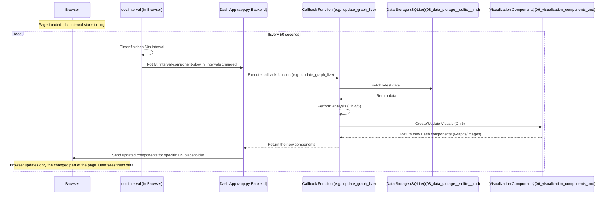

# Chapter 7: Real-time Update Engine

Welcome to Chapter 7! In the [previous chapter](06_visualization_components_.md), we learned how the analyzed data (sentiment trends, hashtag counts, geographic distribution) is transformed into beautiful, interactive [Visualization Components](06_visualization_components_.md) like charts and maps using Plotly and Dash. We now have all the pieces: data collection, storage, analysis, and visualization.

But how does the dashboard stay *live*? Imagine watching a live sports game online. You don't want to keep hitting the refresh button every few seconds to see the latest score, right? The scoreboard updates automatically. Our Twitter analysis dashboard needs the same magic – it should automatically fetch and display the newest data without you having to do anything.

This is the problem solved by the **Real-time Update Engine**. It's the mechanism that makes our dashboard feel alive by regularly refreshing the displayed information.

## What is the Real-time Update Engine?

Think of the Real-time Update Engine as an automatic timer built into our dashboard. In our project (`app.py`), this timer is implemented using a special Dash component called `dcc.Interval`.

*   **It Ticks:** Like a clock, `dcc.Interval` triggers an event at a regular interval (we set it to every 50 seconds in our application).
*   **It Signals:** When the interval "ticks," it signals to our Dash application that it's time for an update.
*   **It Triggers Action:** This signal activates the callback functions (`update_graph_live` and `update_graph_bottom_live` that we saw in Chapters 4, 5, and 6) which then fetch fresh data from the [Data Storage (SQLite)](03_data_storage__sqlite__.md), perform [Sentiment & Time-Series Analysis](04_sentiment___time_series_analysis_.md) or [Text & Geographic Analysis](05_text___geographic_analysis_.md), create new [Visualization Components](06_visualization_components_.md), and update the dashboard display.

Essentially, `dcc.Interval` acts as the pacemaker for our dashboard, ensuring it refreshes periodically to give the appearance of a real-time feed.

## Key Concept: `dcc.Interval`

The star of this chapter is the `dcc.Interval` component provided by Dash Core Components. It's incredibly simple but powerful.

*   **Invisible:** Unlike graphs or text boxes, this component doesn't actually appear visually on the web page. It works silently in the background.
*   **Properties:** It has a few key properties:
    *   `id`: A unique name we give it so our callbacks can listen to it (e.g., `'interval-component-slow'`).
    *   `interval`: The time between ticks, specified in milliseconds. For example, `50000` means 50,000 milliseconds, which is 50 seconds.
    *   `n_intervals`: This is a counter that starts at 0 and increases by 1 every time the interval ticks. This changing number is what our callbacks actually watch for.

## How it Makes the Dashboard Live

The `dcc.Interval` component connects directly to the Dash callback system we learned about in [Chapter 1: Dash Web Application](01_dash_web_application_.md).

**1. Defining the Interval in the Layout:**

First, we include the `dcc.Interval` component somewhere in our `app.layout` definition in `app.py`.

```python
# --- File: app.py ---
import dash_core_components as dcc
import dash_html_components as html

# ... other layout components (Titles, Placeholders) ...

app.layout = html.Div(children=[
    # ... title, placeholders for graphs ...

    # The automatic timer component!
    dcc.Interval(
        id='interval-component-slow',  # Give it a unique name
        interval=50000,              # Set timer to 50,000 ms (50 seconds)
        n_intervals=0                # Counter starts at 0
    ),

    # ... other layout components (Author info, etc.) ...
])
```

*   This code simply adds the `dcc.Interval` to our page layout. It won't show anything, but it will start ticking automatically every 50 seconds once the app is running.

**2. Using the Interval as a Callback Input:**

Next, we tell our callback functions to *listen* to this interval component. We do this by using its `id` and the `n_intervals` property as an `Input` in the `@app.callback` decorator.

```python
# --- File: app.py ---
from dash.dependencies import Input, Output

# ... app layout definition including dcc.Interval ...

# Callback for the TOP row graphs (Sentiment/Time-Series)
@app.callback(
    Output('live-update-graph', 'children'), # Output: Update the top placeholder Div
    [Input('interval-component-slow', 'n_intervals')] # INPUT: Triggered by the timer!
)
def update_graph_live(n): # Function runs every time 'n_intervals' changes
    print(f"Timer ticked {n} times. Updating top graphs...")
    # --- Inside this function (Chapters 4 & 6): ---
    # 1. Fetch recent data from SQLite
    # 2. Perform Sentiment & Time-Series Analysis
    # 3. Create Plotly Line chart and Pie chart
    # 4. Return the new dcc.Graph components
    # --- Example return value (Simplified): ---
    new_top_content = html.Div([ html.P(f"Top graphs updated (tick {n})") ]) # Real graphs go here
    return new_top_content

# Callback for the BOTTOM row graphs (Text/Geo)
@app.callback(
    Output('live-update-graph-bottom', 'children'), # Output: Update the bottom placeholder Div
    [Input('interval-component-slow', 'n_intervals')] # INPUT: Also triggered by the SAME timer!
)
def update_graph_bottom_live(n): # This function ALSO runs every time 'n_intervals' changes
    print(f"Timer ticked {n} times. Updating bottom graphs...")
    # --- Inside this function (Chapters 5 & 6): ---
    # 1. Fetch recent data from SQLite
    # 2. Perform Text & Geographic Analysis
    # 3. Create Plotly Bar chart, Map, and Word Cloud image
    # 4. Return the new dcc.Graph and html.Img components
    # --- Example return value (Simplified): ---
    new_bottom_content = html.Div([ html.P(f"Bottom graphs updated (tick {n})") ]) # Real graphs/images go here
    return new_bottom_content
```

*   The key part is `Input('interval-component-slow', 'n_intervals')`. This tells Dash: "Whenever the `n_intervals` property of the component with ID `interval-component-slow` changes, run the function decorated below it (`update_graph_live` or `update_graph_bottom_live`)."
*   Since `n_intervals` increases by 1 every 50 seconds, both callback functions will automatically execute every 50 seconds.
*   The input argument `n` in the function definitions (`update_graph_live(n)`, `update_graph_bottom_live(n)`) receives the current value of `n_intervals`. We don't always *use* this number inside the function, but its change is what *triggers* the function.

## What Happens Under the Hood?

Let's trace the full update cycle driven by `dcc.Interval`:



1.  The `dcc.Interval` component, running silently in the user's browser, keeps track of time.
2.  After 50 seconds, it increments its internal `n_intervals` counter.
3.  It notifies the Dash backend (running `app.py`) that this property has changed.
4.  Dash sees that `n_intervals` is listed as an `Input` for our two callback functions.
5.  Dash executes these functions (`update_graph_live`, `update_graph_bottom_live`).
6.  Inside these functions, the code fetches fresh data from the [Data Storage (SQLite)](03_data_storage__sqlite__.md), performs the necessary analysis ([Sentiment & Time-Series Analysis](04_sentiment___time_series_analysis_.md) or [Text & Geographic Analysis](05_text___geographic_analysis_.md)), and generates the new [Visualization Components](06_visualization_components_.md).
7.  The functions return the newly created visual components (like `dcc.Graph` or `html.Img`).
8.  Dash takes these returned components and cleverly updates *only the specific `Output` Divs* (`live-update-graph` or `live-update-graph-bottom`) in the browser, without needing a full page reload.
9.  The user sees the updated charts and information seamlessly.
10. The `dcc.Interval` starts timing the next 50 seconds, and the cycle repeats.

## Conclusion

In this chapter, we unveiled the **Real-time Update Engine** of our application. We learned that this seemingly complex "real-time" behavior is achieved using a very simple mechanism:

1.  The **`dcc.Interval`** component acts as an invisible timer in the background.
2.  It periodically increments its **`n_intervals`** counter (every 50 seconds in our case).
3.  This change in `n_intervals` is used as an **`Input`** to trigger our main **`@app.callback`** functions.
4.  These callbacks then run their analysis and visualization logic, automatically refreshing the dashboard content.

This simple timer component is the key to keeping our dashboard updated with the latest insights from the Twitter data stream without requiring any manual intervention from the user.

We've now seen the main flow of the application, from collecting data to displaying it live. However, we glossed over some details, like how we prepared the country data used for the geographic map in [Chapter 5](05_text___geographic_analysis_.md). Let's look at that preparation step next.

**Next:** [Chapter 8: Geographic Data Preparation](08_geographic_data_preparation_.md)

---

Generated by [AI Codebase Knowledge Builder](https://github.com/The-Pocket/Tutorial-Codebase-Knowledge)