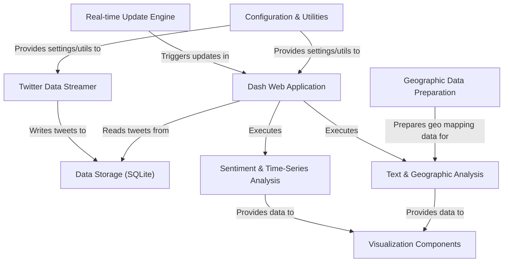

# Tutorial: test_app_new

This project is a **real-time dashboard** that monitors **Twitter** for specific keywords (like *COVID19*).
It collects live tweets, analyzes their *sentiment* (positive/negative/neutral) and geographic origin, and then displays these insights using interactive charts and maps.
The dashboard automatically refreshes, providing an *up-to-date view* of the conversation around the tracked topic.

**Source Repository:** [https://github.com/raiakash203/Real-Time-Twitter-Analysis](https://github.com/raiakash203/Real-Time-Twitter-Analysis)

## Chapters

1. [Dash Web Application
](01_dash_web_application_.md)
2. [Twitter Data Streamer
](02_twitter_data_streamer_.md)
3. [Data Storage (SQLite)
](03_data_storage__sqlite__.md)
4. [Sentiment & Time-Series Analysis
](04_sentiment___time_series_analysis_.md)
5. [Text & Geographic Analysis
](05_text___geographic_analysis_.md)
6. [Visualization Components
](06_visualization_components_.md)
7. [Real-time Update Engine
](07_real_time_update_engine_.md)
8. [Geographic Data Preparation
](08_geographic_data_preparation_.md)
9. [Configuration & Utilities
](09_configuration___utilities_.md)

---

Generated by [AI Codebase Knowledge Builder](https://github.com/The-Pocket/Tutorial-Codebase-Knowledge)